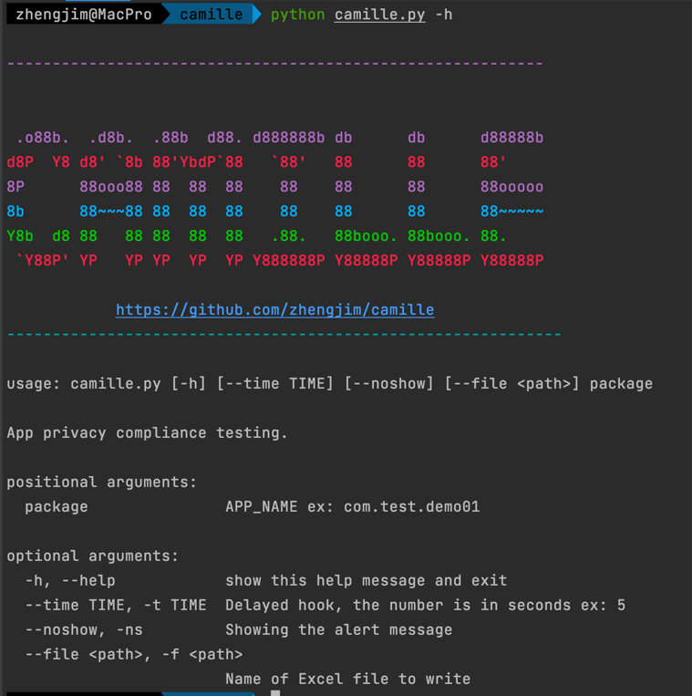
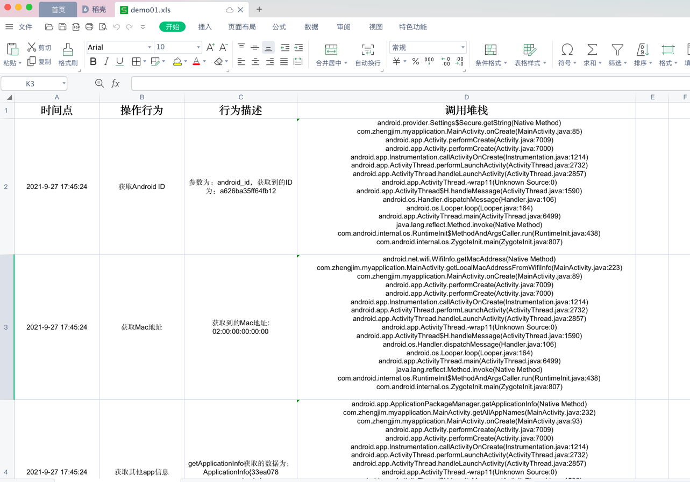
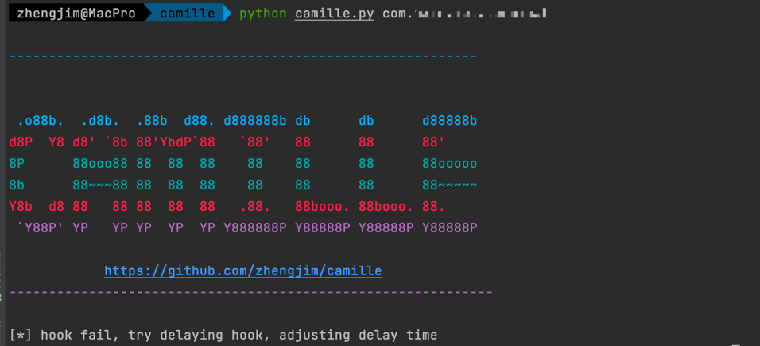
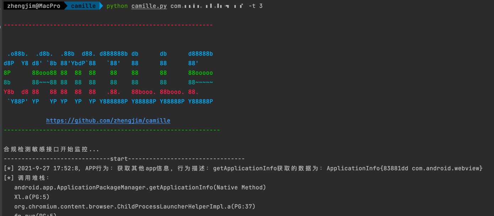

# Camille

Android App隐私合规检测辅助工具

## 简介

现如今APP隐私合规十分重要，各监管部门不断开展APP专项治理工作及核查通报，不合规的APP通知整改或直接下架。camille可以hook住Android敏感接口。根据隐私合规的场景，辅助检查是否符合隐私合规标准。

## 安装

环境：

python3、frida 、一台已root手机(我测试机为Redmi 3s，刷机成魔趣Android 8.1，感觉问题挺多的)，并在手机上运行`frida-server`。

下载：

```
git clone https://github.com/zhengjim/camille.git
cd camille
pip install -r requirements.txt
python camille.py -h
```



## 用法

简单使用：

```
python camille.py com.zhengjim.myapplication
```


`com.zhengjim.myapplication`为测试app的包名，会显示时间、行为和调用堆栈。可以根据场景来判断是否合规，如：获取敏感信息是否是在同意隐私政策之前等。

```
python camille.py com.zhengjim.myapplication -ns -f demo01.xls
```

- -ns：不显示日志。默认显示
- -f： 保存app行为轨迹到到execl里。默认不保存。



```
python camille.py com.zhengjim.myapplication -t 3
```

- -t： hook应用自己的函数或含壳时，建议使用setTimeout并给出适当的延时(1-5s，需要根据不同app进行调整)。以免hook失败。默认不延迟。

如下图：不加延迟hook失败。

加了延迟hook成功。


## 后记

本来想使用uiautomator2或appium来模拟点击制定场景，~~但后续调研发现纯自动化的检测是不全的，最多也就检测20-30%，还是得结合人工来检测。索性就删除了模拟点击这块。~~(其实就是懒，不定期更新)

## 参考链接

- https://github.com/Dawnnnnnn/APPPrivacyDetect
- https://github.com/r0ysue/r0capture/
- https://github.com/ChenJunsen/Hegui3.0
